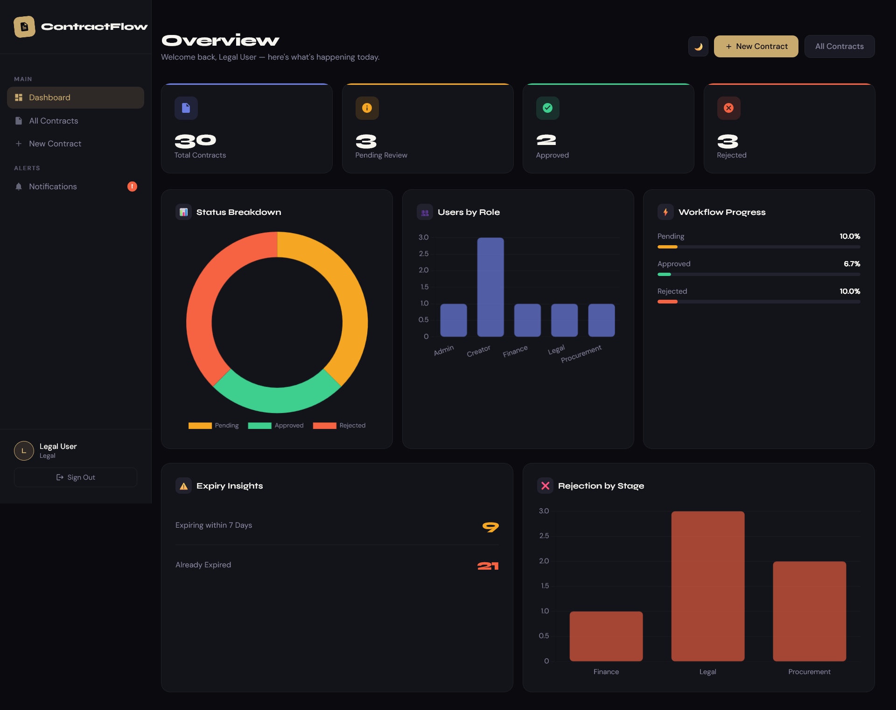

# Contract Management System

A web-based contract lifecycle management system built with Flask and MySQL. It allows organizations to create, submit, review, and approve contracts through a multi-stage workflow involving Legal, Finance, and Procurement teams.

| Roll number | Name              | PRN        |
|-------------|-------------------|------------|
| 45          | Dnyaneshwari Kale | 1032231585 |
| 49          | Alvin Jiju        | 1032231794 |
| 53          | Vedant Hulage     | 1032231876 |
| 56          | Parth Tupe        | 1032231918 |



---

## Features

- Role-based login (Admin, Creator, Legal, Finance, Procurement)
- Create contracts with PDF upload
- Multi-stage approval workflow (Legal → Finance → Procurement)
- Contract intelligence — PDF text extraction, keyword detection, risk flagging
- Expiry tracking with automatic notifications
- Dashboard with analytics per role
- Admin panel for user management
- Auto-cleanup of old rejected/expired contracts

---

## Tech Stack

| Layer    | Technology          |
|----------|---------------------|
| Backend  | Python, Flask       |
| Database | MySQL               |
| Frontend | HTML, Jinja2        |
| PDF      | PyPDF2              |
| Auth     | Flask Sessions      |

---

## Setup & Installation

**1. Clone the repository**
```bash
git clone https://github.com/onlycolab8/semContractWorkflow.git
cd semContractWorkflow
```

**2. Create and activate a virtual environment**
```bash
python -m venv .venv
.venv\Scripts\activate        # Windows
source .venv/bin/activate     # Mac/Linux
```

**3. Install dependencies**
```bash
pip install flask flask-login mysql-connector-python PyPDF2
```

**4. Configure the database**

Open `db.py` and update the credentials:
```python
DB_CONFIG = {
    "host": "localhost",
    "user": "root",
    "password": "your_password"
}
```

**5. Initialize the database and seed users**
```bash
python db.py
```

**6. Run the app**
```bash
python app.py
```

Visit `http://127.0.0.1:5000` in your browser.

---

## Default Login Credentials

| Role        | Email               | Password |
|-------------|---------------------|----------|
| Admin       | admin@gmail.com     | 1234     |
| Creator     | creator@gmail.com   | 1234     |
| Legal       | legal@gmail.com     | 1234     |
| Finance     | finance@gmail.com   | 1234     |
| Procurement | proc@gmail.com      | 1234     |

---

## Approval Workflow

```
Creator → Legal → Finance → Procurement → Approved
```

At any stage a reviewer can approve (moves to next stage), reject (ends the contract), or request changes (sends back to Creator).

---
